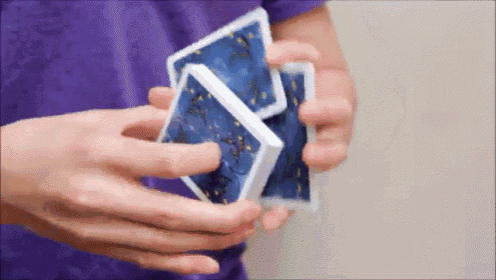

SUPSI 2026  
Corso d’interaction design, CV429.01  
Docenti: A. Gysin, G. Profeta  

Progetto 1: La conquista dello spazio

# NASA - Perseverance Rover
Autore: Nahele Belli \
[NASA - Perseverance Rover](https://naheleee.github.io/NaheleBelli_IXD_2026/Progetto1_PerseveranceRover/)


## Introduzione e tema
Rover marziano "Perseverance" (NASA)


## Riferimenti progettuali
lorem ipsum


## Design dell’interfaccia e modalità di interazione
Pagina web ludica, semplice e non troppo tecnica

https://github.com/user-attachments/assets/38d1768e-a90e-45dd-b12b-1ac0aa1151b3

[]()


## Tecnologia usata
lorem ipsum


```JavaScript
const image = new Image();
image.onload = () => {
    gl.bindTexture(gl.TEXTURE_2D, texture);
    gl.texImage2D(
        gl.TEXTURE_2D,
        level,
        internalFormat,
        srcFormat,
        srcType,
        image
    );
    if (isPowerOf2(image.width) && isPowerOf2(image.height)) {
        gl.generateMipmap(gl.TEXTURE_2D);
    } else {
        gl.texParameteri(gl.TEXTURE_2D, gl.TEXTURE_WRAP_S, gl.CLAMP_TO_EDGE);
        gl.texParameteri(gl.TEXTURE_2D, gl.TEXTURE_WRAP_T, gl.CLAMP_TO_EDGE);
        gl.texParameteri(gl.TEXTURE_2D, gl.TEXTURE_MIN_FILTER, gl.LINEAR);
    }
};
image.src = url;
```

## Target e contesto d’uso
Giovani, adulti, appassionati, curiosi

[]()
